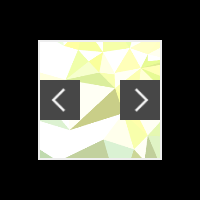

# Blackroom

A buttery smooth lightbox image viewer for the desktop.

Remember those lightboxes that were all the hype in 2005? Ever wished you can preview image files in a lightbox on your desktop? Look no more! [Download the latest version](https://github.com/yishn/Blackroom/releases/).

## Building

Make sure you have Node.js and npm installed. First, clone Blackroom:

~~~
$ git clone https://github.com/yishn/Blackroom
$ cd Blackroom
~~~

Install `electron-packager` globally and the dependencies of Blackroom:

~~~
$ npm install electron-packager -g
$ npm install
~~~

You can build Sabaki on Windows by using:

~~~
$ npm run build:win
~~~

For macOS use:

~~~
$ npm run build:osx
~~~

The binaries will be in `Blackroom/bin/`.

## Third Party Libraries

* [Electron](http://electron.atom.io/)
  ([MIT License](https://github.com/atom/electron/blob/master/LICENSE))
* [Sprint](https://github.com/bendc/sprint)
  ([MIT License](https://github.com/bendc/sprint/blob/master/LICENSE.txt))
* [Octicons](https://octicons.github.com/)
  ([License](https://github.com/github/octicons/blob/master/LICENSE.txt))

## License

MIT
